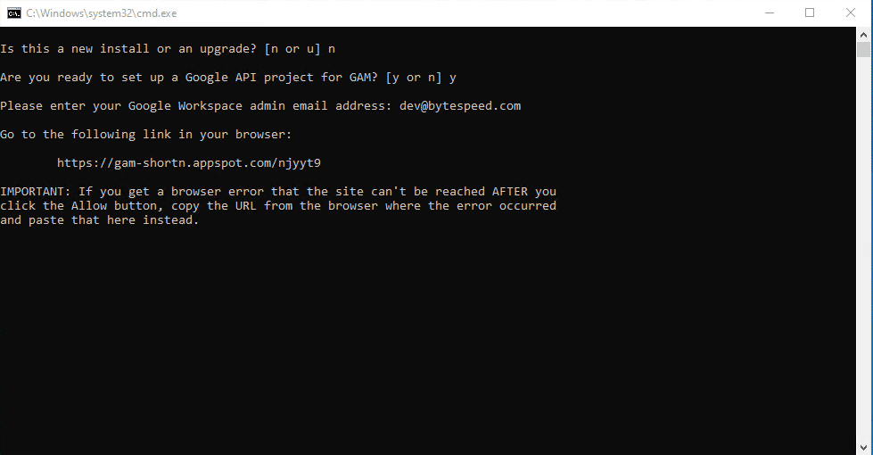
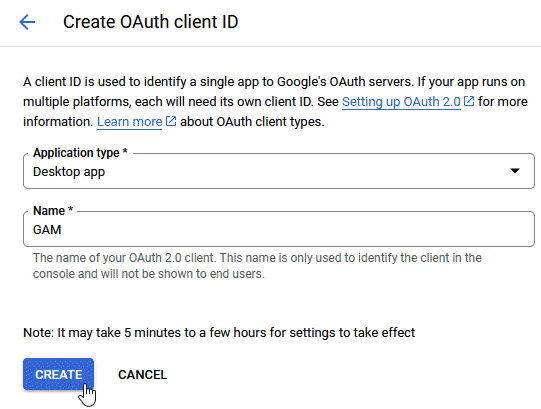
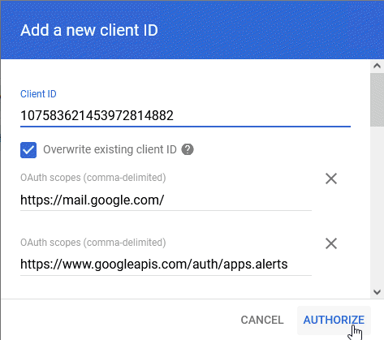

Deployment
=====

Setting up GAM
------------

Setting up GAM is the easiest way to deploy the AppStream custom Attribute if you currently do not use another tool such as Gopher for Google Workspace management. Follow these instruction to set up GAM:

1. Download the latest release of GAM: https://github.com/GAM-team/GAM/releases
    * Download the release ending in windows-x86_64.msi
2. Run the Installer. In the Windows protected your PC window click more info, then click Run anyway.
3. Run through the setup
 .. only:: html

   .. figure:: _static/gam/GAM_Setup.gif
   
4. A command prompt window will open. In that window:
	* When asked Is this a new install or an upgrade?, Type 'n' and press Enter
	* When asked Are you ready to set up a Google APU Project for GAM?, Type 'y' and press Enter
	* Enter your email address (Needs Super Admin Rights) and press Enter

5. A web browser will open. Sign into your Google Account and Allow GAM Project Creation to access your Google Account
6. Back in the command prompt wait for the project creation to complete. You may need to agree to the Google Cloud Terms of Service. Copy and Paste the link in the Command Prompt to do so.
7. Back in the command prompt press enter and wait for the APIs to setup. Then setup the oauth client by copying the link into your web browser. Select Desktop app for the Application type and use GAM for the Name. Then click create.

8. An OAuth client created window will pop up. Copy the Client ID and paste it into the command prompt window, then press enter. Then do the same for the Client Secret.
9. Back in the command prompt window:
	* When asked if you want to authorize GAM to preform Google Workspace management operations, type 'y' and press Enter.
	* It will then list the available APIs. When prompted type 'c' and press Enter
10. In the web browser that opens scroll all the way down and press Allow, then return to the command prompt window:=.
11. When asked Are you ready to authorize GAM to manage Google Workspace user data and settings type 'y' and press Enter. Then enter your email address and press Enter.
.. only:: html

   .. figure:: _static/gam/GAM_API.gif
   
12. GAM will then test to see if your user has permissions for each API. Some of them should fail the first time.  Copy the url to Authorize your account and open it in the web browser.
13. Click AUTHORIZE in the Add a new Client ID popup. 

14. Return to the command prompt window and type 'y' and press Enter. The API test should come back as PASS. Press Enter to continue. (Note this can take a while to happen so if it fails again, please wait a few minutes and try again)
.. image:: _static/gam/apipass.png
15. Return to the installer and click Finish. Congratulations you have Installed and configured GAM!