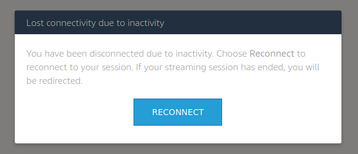

Ending your Session
=====

If you end your session by choosing End session on the navigation toolbar, you are prompted to save any open documents and are then disconnected from the streaming instance. Any unsaved documents cannot be recovered.

**To end your session:**

1. Select Profile from the navigation bar

    .. image:: _static/navbar_profile.png
	   :scale: 50%

2. Select **End session** to logout

    .. image:: _static/navbar_endsession.png

Idle Disconnect
------------

AppStream will automatically disconnect idle users after 15 minutes *(Default)*. A notification will appear informing you that you are about to be disconnected due to inactivity. If you reconnect in the next 5 minutes you will be reconnected to the same streaming session, otherwise, you will start a new streaming session.

Users are considered idle when they stop providing keyboard or mouse input during their streaming session. File uploads and downloads, audio in, audio out, and pixels changing do not qualify as user activity.

Max Session Duration
------------

AppStream session length is capped at 60 minutes *(Default)*. If you are still connected five minutes before this limit is reached, you are prompted to save any open documents before being disconnected. After this time elapses, the instance is terminated and replaced by a new instance.
