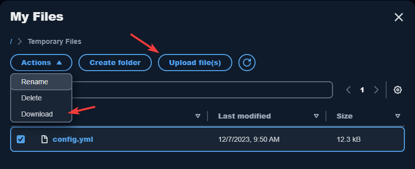

Using Google Drive
=====

You can do the following in Google Drive
------------

* **Open and edit files and folders** that you store in Google Drive. Content that is stored in Google Drive is specific to you. Other users cannot access your content unless you choose to share it.

* **Upload and download files between your local computer and Google Drive**. Any changes that you make to your files and folders in Google Drive during a streaming session are automatically backed up and synchronized. They are available to you when you sign in to your Google Drive account and access Google Drive outside of your streaming session.

* When you are working in an application, you can **access your files and folders that are stored in Google Drive**. Choose File, Open from the application interface and browse to the file or folder that you want to open.

* To **save your changes** in a file to Google Drive, choose **File, Save** from the application and browse to the location in Google Drive where you want to save the file.

* You can also access Google Drive by choosing **My Files** from the top left of the AppStream toolbar.

Add your Google Drive account to AppStream
----------------

To access your Google Drive, you must first add your Google Drive account to AppStream:

1.	In the top left of the AppStream 2.0 toolbar, choose the **My Files** icon.

2.	In the **My Files** dialog box, choose **Add Storage**.

.. image:: _static/myfiles_addstorage.png

3.	Choose **Google Drive**.

4.	Under Login accounts, choose the domain for your Google Drive account.

5.	5.	The **Sign in with Google** dialog box is displayed. Enter the user name and password for your Google Drive account when prompted.

6.	After your Google Drive account is added to AppStream, your Google Drive folder displays in **My Files**.

7.	To work with your files and folders in **Google Drive**, choose the Google Drive folder and browse to the file or folder you want. If you do not want to work with files in Google Drive during this streaming session, close the **My Files** dialog box.

Open a files located in Google Drive from within an application
----------------

Often times you will want to open a file located on Google Drive from within an application you are using on AppStream.  The following are general steps using Microsoft Word to illustrate this process.  Note: Every application is different but the process is very similar.

1. From within Microsoft Word go to **File > Open > Browse**

.. image:: _static/word_open_file.png
   :scale: 50%

2. Browse to **This PC > Google Drive** and select the appropriate drive to where your file(s) is located.'

Upload and download files between your local computer and your Google Drive
----------------

1.	In the top left of the AppStream 2.0 toolbar, choose the **My Files** icon.

2.	In the **My Files** dialog box, choose **Google Drive**.

3.	Navigate to an existing folder, or choose **Add Folder** to create a folder.

4.	When the folder is displayed, do one of the following:

    *	To upload a file to the folder, select the file that you want to upload, and choose **Upload**.

    *	To download a file from the folder, select the file that you want to download, choose the down arrow to the right of the file name, and choose **Download**.

Remove Google Drive permissions from AppStream
----------------

If you no longer want to use Google Drive during your AppStream 2.0 streaming sessions, follow these steps to remove Google Drive permissions from AppStream 2.0.

_Note: You can restore these permissions at any time during an AppStream 2.0 streaming session._

1. Go to https://myaccount.google.com

2. Click your photo (or the generic human icon) at the right end of the Google toolbar. Check that you are logged in with your **schools account**. If you are not, pick that account from the list of accounts displayed. If your account is not shown, click **Add account** and log in.

3. In the **Sign-in & security panel**, click **Apps with account access**. The **Sign-in & security** page will open with the **Apps with account access** section displayed.

4. Click **MANAGE APPS**.

5. In the **Signing in with Google** box, click **Amazon AppStream 2.0**.

6. Click **Remove Access**. When asked, confirm your choice.
