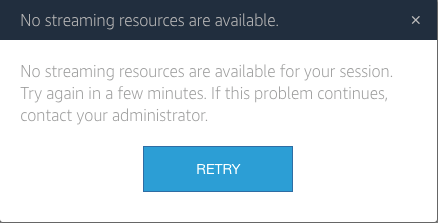
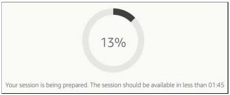
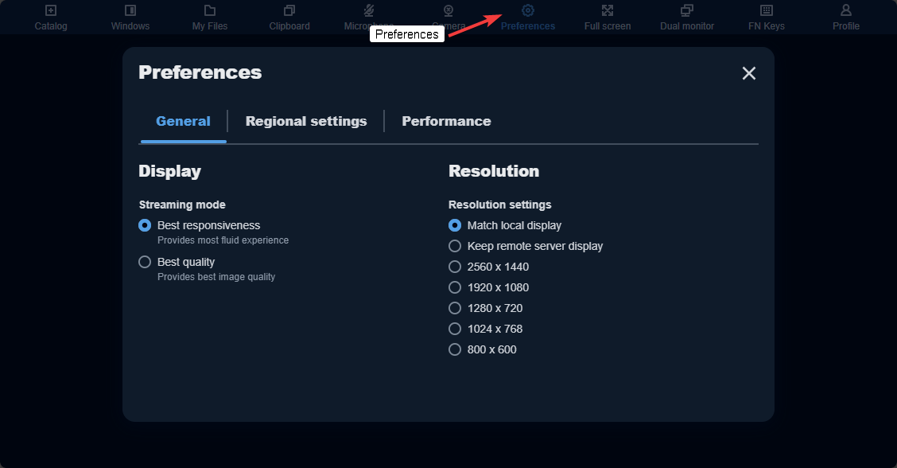
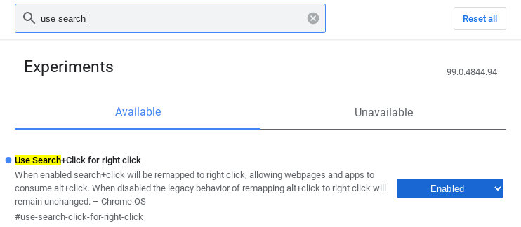
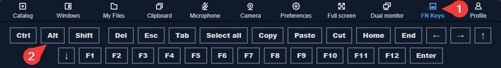
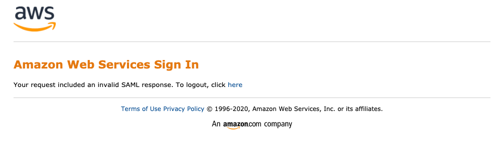

Common Problems & FAQ
=====

No Streaming Resources are Available
------------

If you see the message "No streaming resources are available for your session" when connecting to AppStream, all available AppStream sessions are currently in use.

AppStream is aware of your attempt to connect, and will begin preparing additional sessions, a process that could take up to 30 minutes. We suggest you retry your login again. If you continue receiving this error, please contact ByteSpeed.

Why do I have to wait 2 minutes after I log in?
------------

The initial two-minute load time after you have selected your application is the time that it takes to prepare your session to run. This only happens once per session.

Application appears as a black box
------------

If an app's window appears as a black box instead of showing the app, first wait a minute to see if application loads as the first application launch of the session may be slower than usual. If it still has not shown, follow these steps:

1. Close AppStream tab and reconnect to your existing session
    * If that doesnt work continue on
2. Click the User icon in the Navigation Bar
3. Select End Session
4. Restart a new AppStream session

Screen resolution errors or Windows cut off
------------

In certain applications (ex. Autodesk or Adobe) you may receive an error saying it requires a higher resolution or certain windows will have elements that are off the screen and you cannot access. In these cases you can try the following in the nav bar:

1. Set AppStream to Fullscreen
2. Set the sceen resolution manualy and it will scale down to your devices resolution

Chromebook Alt+Click Issues (Adobe tools)
------------

In certain applications (ex. Photoshop) you need to use a tool that requires you to use Alt+Click (ex. Healing Brush Tool). By default Chromebooks use Alt+CLick as a shortcut to the Right-Click dialog. In these instances you can do one of the following:

1. Set the Right-Click dialog shortcut to Search+Click:
    * Open chrome://flags on your Chromebook. Then search for and enable the feature Use Search+Click for right click.
    

2. Using the `Navigation Bar <https://claas-documentation.readthedocs.io/en/latest/navbar.html#navigation-bar>`_, Select Fn, Select Alt. Left Click normally where you need to Alt+Click. After, select Alt again to turn off the selection.

Invalid SAML Response
------------

If you see a message that says "Your request included an invalid SAML response" it means you are not authorized for access to AppStream.

