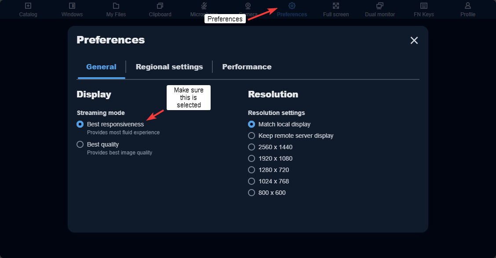
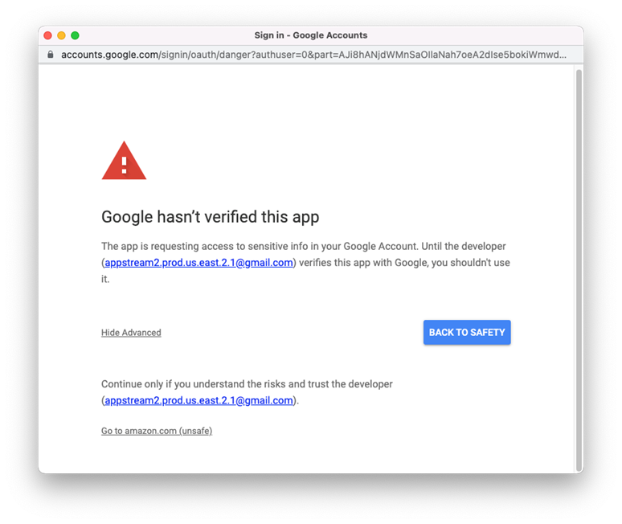

Common Problems & FAQ
=====

No Streaming Resources are Available
------------

If you see the message "No streaming resources are available for your session" when connecting to AppStream, all available AppStream sessions are currently in use.

.. image:: _static/no_streaming_resources.png

AppStream is aware of your attempt to connect, and will begin preparing additional sessions, a process that could take up to 30 minutes. We suggest you retry your login again. If you continue receiving this error, please contact ByteSpeed.

Why do I have to wait 2 minutes after I log in?
------------

The initial two-minute load time after you have selected your application is the time that it takes to prepare your session to run. This only happens once per session.

.. image:: _static/streaming_timer.png

Application appears as a black box
------------

If an app's window appears as a black box instead of showing the app, first wait a minute to see if application loads as the first application launch of the session may be slower than usual. If it still has not shown, follow these steps:

1. Close AppStream tab and reconnect to your existing session
    * If that doesnt work continue on
2. Click the User icon in the Navigation Bar
3. Select End Session
4. Restart a new AppStream session

Screen resolution errors or Windows cut off
------------

In certain applications (ex. Autodesk or Adobe) you may receive an error saying it requires a higher resolution or certain windows will have elements that are off the screen and you cannot access. In these cases you can try the following in the nav bar:

1. Set AppStream to Fullscreen
2. Set the sceen resolution manualy and it will scale down to your devices resolution

.. image:: _static/set_resolution.png

Setting streaming mode (Latency Issues)
------------

In certain circumstances you may want to check the streaming mode AppStream is set to. Making sure it’s in Best Responsiveness may help alleviate latency issues. You can do the following to check:

1. Select Setting in the Nav Bar
2. Click on Streaming mode
3. Make sure Best responsiveness is selected.

Note: Latency issues can also be cause by AppSream server loads and local network performance.

Chromebook Alt+Click Issues (Adobe tools)
------------

In certain applications (ex. Photoshop) you need to use a tool that requires you to use Alt+Click (ex. Healing Brush Tool). By default Chromebooks use Alt+CLick as a shortcut to the Right-Click dialog. In these instances you can do one of the following:

1. Set the Right-Click dialog shortcut to Search+Click:
    * Open chrome://flags on your Chromebook. Then search for and enable the feature Use Search+Click for right click.
    

2. Using the `Navigation Bar <https://claas-documentation.readthedocs.io/en/latest/navbar.html#navigation-bar>`_, Select Fn, Select Alt. Left Click normally where you need to Alt+Click. After, select Alt again to turn off the selection.

Invalid SAML Response
------------

If you see a message that says "Your request included an invalid SAML response" it means you are not authorized for access to AppStream. Please work with your IT Team to add your user to the appopriate group or add the attribute value to your profile.

.. image:: _static/invalid_saml.png
   :scale: 50%

Malformed Certificate Error
------------

If you see a message that says "Error: malformed_certificate" it means the SAML app for AppStream more than likely has an expired certificate.

In order to fix the error please do the following:

1. Log into your google admin
	* https://admin.google.com/ac/apps
2. Find the AppStream SAML app
3. Manage the certificates for the app and add a new certificate
 .. image:: _static/new_certificate.png
   :scale: 75%
4. Select the new certificate from the certificate dropdown
	* Note: After ​creating a new certificate you must also select it from the dropdown. This isn't done automatically by Google.
 .. image:: _static/select_certificate.png
   :scale: 75%
5. Save your changes
6. Send ByteSpeed a copy of your new metadata.xml file
	* cloud@bytespeed.com
	

Google hasn't verified this app (Google Drive Link)
------------

If you see a message that says "Google hasn't verified this app". Please work with your IT Team to add the AppStream Google Drive Connector to the approved app list in Google Workspaces using the instuctions below:

In order to fix the error please do the following:

1. Log into your google admin
	* https://admin.google.com/ac/apps
2. On the left side navigate to Security > Access and data control > API controls
3. In the App access control section, choose MANAGE THIRD-PARTY APP ACCESS.
4. Choose Add app, and then choose OAuth App Name Or Client ID.
6. Enter the Amazon AppStream 2.0 OAuth client ID for your AWS Region, and then choose SEARCH.
    * Search for this Client ID: 723951369598-6tvdlf52g2qh0qa141o4k1avasvnj51i.apps.googleusercontent.com
7. In the search results, choose Amazon AppStream 2.0, and then choose Select.
8. In the Client ID page, under OAuth Client ID, verify that the correct ID appears in the list, and then select the check box to the left of the ID.
9. On the lower right of the page, choose SELECT.
10. Under App access, choose Trusted: Can access all Google services, and then choose CONFIGURE.
11. Verify that the Amazon AppStream 2.0 app, with the correct OAuth ID, appears in the list of connected apps.