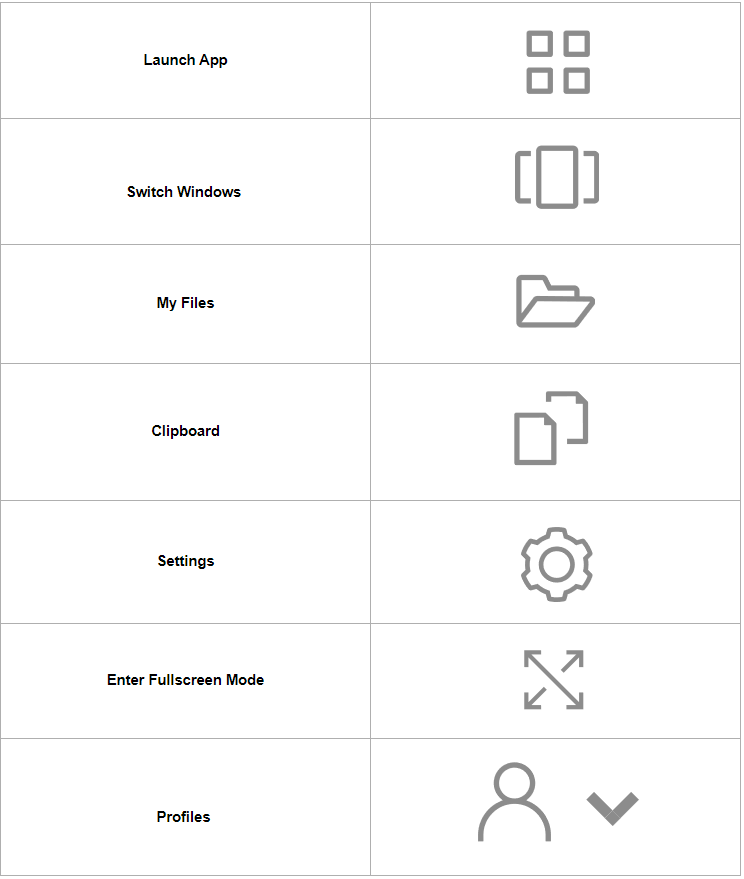
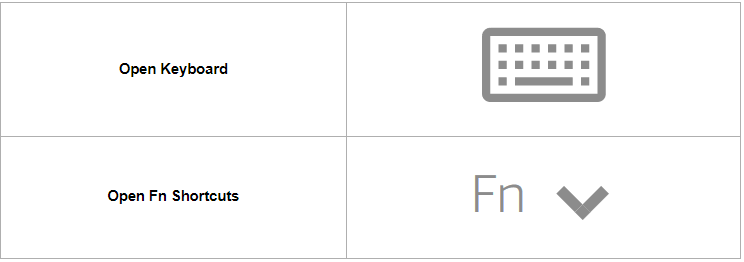

Navigation Bar
=====

When using AppStream, a toolbar with navigation icons will be displayed between the browser header and the AppStream application.

Navigation Bar Icons
------------

**Launch App** - AppStream allows multiple applications to run at the same time. Available applications are displayed in this list. Select an application to launch it. Your current application(s) will remain open.

**Switch Windows** - When you have more than one application started, this option will display icons for each application. Click an application icon to bring it to the front.

**My Files** - Access your Google Drive, OneDrive, and Temporary Files. Temporary Files disappear at the end of each session, so be sure to save your work in Google Drive (link) or OneDrive (link)

**Clipboard** - Use this option to copy and paste from your local computer if it is not working automatically.

**Settings** - A few options such as enabling your microphone and adjusting your screen size are available. Most users never alter these.

**Enter Fullscreen Mode** - Allow the AppStream application to utilize your entire screen. Press Esc to exit Fullscreen Mode.

**Profiles** - Feedback and Logout are available - AppStream allows multiple applications to run at the same time. Available applications are displayed in this list. Select an application to launch it. Your current application(s) will remain open.

Touchscreen Device Options
------------

**Open Keyboard** - Tap to display the on-screen keyboard on an iPad or Android tablet. The keyboard icon turns blue, and you can use the on-screen keyboard to input text within the streaming application. Tap the keyboard icon again to hide the on-screen keyboard.

**Open Fn Shortcuts** - Tap the Fn icon to display a row of Windows-specific keys and keyboard shortcuts.
