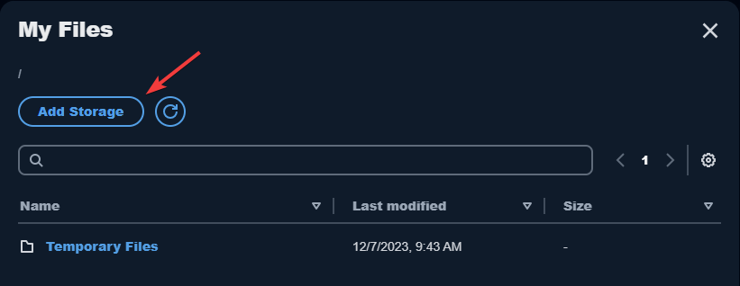
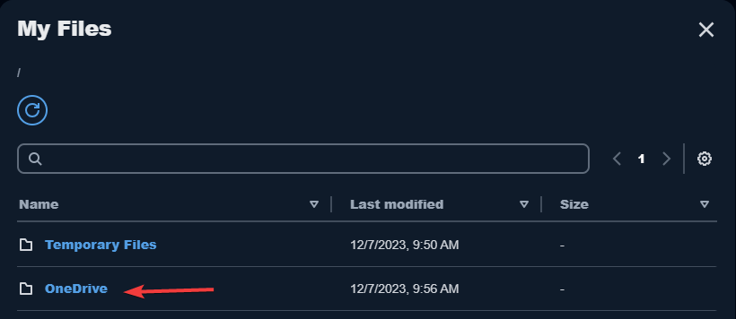

Using OneDrive
=====

You can do the following in OneDrive
------------

* **Open and edit files and folders** that you store in OneDrive. Content that is stored in OneDrive is specific to you. Other users cannot access your content unless you choose to share it.

* **Upload and download files between your local computer and OneDrive**. Any changes that you make to your files and folders in OneDrive during a streaming session are automatically backed up and synchronized. They are available to you when you sign in to your OneDrive account and access OneDrive outside of your streaming session.

* When you are working in an application, you can **access your files and folders that are stored in OneDrive**. Choose File, Open from the application interface and browse to the file or folder that you want to open.

* To **save your changes** in a file to OneDrive, choose **File, Save** from the application and browse to the location in OneDrive where you want to save the file.

* You can also access OneDrive by choosing **My Files** from the top left of the AppStream toolbar.

Add your OneDrive account to AppStream
----------------

To access your OneDrive, you must first add your OneDrive account to AppStream:

1.	In the top left of the AppStream 2.0 toolbar, choose the **My Files** icon.

.. image:: _static/navigation_myfiles.png

2.	In the **My Files** dialog box, choose **Add Storage**.

3.	Choose **OneDrive**.

4.	Under Login accounts, choose the domain for your OneDrive account.

5.	The **Permissions requested** dialog box displays. Sign in with your username and password, if requested. Then click **Accept**.

6.	After your OneDrive account is added to AppStream, your OneDrive folder displays in **My Files**.

7.	To work with your files and folders in **OneDrive**, choose the OneDrive folder and browse to the file or folder you want. If you do not want to work with files in OneDrive during this streaming session, close the **My Files** dialog box.

Open a files located in One Drive from within an application
----------------

Often times you will want to open a file located on One Drive from within an application you are using on AppStream.  The following are general steps using Microsoft Word to illustrate this process.  Note: Every application is different but the process is very similar.

1. From within Microsoft Word go to **File > Open > Browse**

2. Browse to **This PC > One Drive** and select the appropriate drive to where your file(s) is located.'

Upload and download files between your local computer and your OneDrive
----------------

1.	In the top left of the AppStream 2.0 toolbar, choose the **My Files** icon.

2.	In the **My Files** dialog box, choose **OneDrive**.

3.	Navigate to an existing folder, or choose **Add Folder** to create a folder.

4.	When the folder is displayed, do one of the following:

    *	To upload a file to the folder, select the file that you want to upload, and choose **Upload**.

    *	To download a file from the folder, select the file that you want to download, choose the down arrow to the right of the file name, and choose **Download**.

.. image:: _static/myfiles_upload_download.png

Remove OneDrive permissions from AppStream
----------------

If you no longer want to use OneDrive during your AppStream 2.0 streaming sessions, follow these steps to remove OneDrive permissions from AppStream 2.0.

_Note: You can restore these permissions at any time during an AppStream 2.0 streaming session._

1. Sign in to `Office 365 <https://portal.office.com/>`_ with your account.

2. In the right pane, under **My accounts**, choose **My account**.

3. On the account dashboard page, in **App permissions**, choose **Change app permissions**.

4. On the **App permissions** page, under **Amazon AppStream 2.0**, choose **Revoke**.