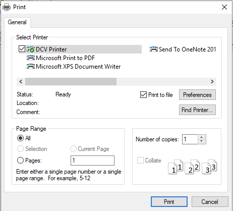

Printing
=====

Print locally by exporting to a PDF
------------

*Note: The print dialog may look different depending on the application you are trying to print from. The example below is from Notepad++. Regardless, the process should be very similar, using the DCV Printer as your selected printer.*

Instructions:

1. From the app toolbar, click **File > Print**

2. In the print dialog box, select **DCV Printer**

3. Check the **Print to file** box and enter the name of the file. Click **Print**

4. A "Save Print Output As" dialog box will pop up next. Give the file any name you wish and click **Save**

5. The file will open in new tab in your web browser as a PDF. Save it on your computer or print it
